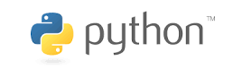

** October 25, 2018

# Why Python?
- it is open source
- syntax relatively intuitive compared to other languages
- programs can be easier to read due to formatting conventions (e.g., indent code blocks)
- interpreted rather than compiled
- grown into one of the top 5 most popular  language for programming
- Ranking the languages by usage
- https://www.tiobe.com/tiobe-index/

- want to drink the kool-aid? Look online, e.g., https://docs.python-guide.org/intro/news/

# Python 2 vs 3
- Version 2.7 remains heavily used but support for it is being deprecated
- Version 3.6 is what you should be using
- differences in coding are relatively minor but can create issues

# Python is:
- dynamically typed, which means the type of variable (integer, float) is determined from the data assigned to that variable
- case sensitive: temperature, Temperature, and TEMPERATURE are 3 distinct variable names
- object oriented: everything is an object, which makes coding very flexible but also can be confusing. We'll tend to use python in a procedural programming context that should minimize the confusion.

# Your own version of python
- https://www.anaconda.com/download/
- takes a lot of space but worth it
- make sure you install the 3.6 (or higher) Version
- you will want to make sure the following libraries are installed (they should be): NumPy, SciPy, matplotlib, Basemap, pandas

# Terminology
You need to become familiar with terms used typically for all programming languages

- statement: instruction to a computer
- object: anything that a variable can be referred to
- variable: name of an object
- expression: combo of numbers, text, variables, and operators that result in a new object when evaluated
- assignment: a statement that binds an expression (object) to a variable (name)
- function:  a block of statements used to create a new object
- algorithm: recipe for how to solve a problem
- code: program content
- executable: file used to run a programs
- verification: providing evidence that the program works correctly
- debugging: locating and correcting errors in a programs

# Interactive Python on Macs
- type in a terminal window:
  - `which python3`
  - `python3`
  - `1+2`
  - `1./2`
  - `1*2`
  - `1**2`
  - `1%2`
- you are now using the built-in Interactive Development Environment (IDLE)
- `help()`
- Exiting the IDLE depends on the version installed.
    - `quit()`
    - or `ctrl-D` or `ctrl-Z`
    - use `quit` to see which ones apply

# Code blocks, indentation, and continuation
- type:
```
for i in range (0,3):
     x = i*2
     print(x)
```
  - did it work or did you get errors? - what is this code?
  - we are looping over the values of i, 0, 1, 2 (first number and less than last number)
  - the colon (:) indicates that a code block follows
  - note the indenting, usually 4 spaces
  - assign to x double the value of i
  - print() is a function that takes input (x in this case) and writes to the screen
- use `\` to extend a statement to the next line (we'll see there are exceptions when dealing with lists and arrays)

# Variable names
- use combos of letters and numbers, but can't start with a numbers
- use descriptive names: `temp` or `temperature` is better than `t`
- use underscores for longer names: `potential_temperature`
- use all CAPS for constants: `TEMP_0C_IN_K= 273.15` (note use of underscores)
- be aware that there are 32 function names that are reserved (avoid overall using a variable name that is the same as well-known function names)

# Data Types (that we care about)
- Boolean
  - either `True`  or `False`
  - `True` equivalent to 1 or 1.0
  - `False` equivalent to 0 or 0.0
  - try: `bool(3)` ,  `bool(0)` , `bool(1-1)`
  - what was returned in each case?
  - to see what type something is use type:
    - `type(bool(1-1))`
    - that shows what class or type it is
- Integer
  - between `-2**31 and 2**31 - 1`
  - signed integer using 32 bits (the sign is the 32nd)
  - to convert to an integer: `int(5.333)`
- Floating Point
  - uses 64 bits (or what is referred to as double precision in many other languages)
  - to convert to a float:
  - `float(10)`
- None
  - If a variable is created but not assigned a value, then it has the None type
  - try
    - `a = None`
    - `print(a)`
- String
  - a sequence of characters
  - enclosed by single or double quotes and triple quotes can be used Terminology
  - try:
    - `"Hi"`
    - `b = "Hello I'm John"`
    - `print(b)`
  - to format strings use the format function. Try:
    - `x = 9.356`
    - `'The value of x is: {0.6.1f}'.format(x)`
    - what did you get?
    - Here's info on formats: https://kapeli.com/cheat_sheets/Python_Format_Strings.docset/Contents/Resources/Documents/index
    - or the gory details: https://docs.python.org/3/library/string.html#format-string-syntax
  - string interpolation or the string modulo operator
    - simpler!
    - `'The value of x is: %6.1f' % x`
    - The first string modulus % indicates the format of the variable after the second %
    - `'x= %6.1f is less than %3d' % (x,10)`

# Lists and Tuples
- Lists
  - a collection of objects
  - A list is mutable, meaning that the contents of the list can be changed after it is created
  - contents enclosed by brackets and separated by commas
  - contents of a list don't have to be of the same type
  - try:
    - `my_list = [9, -3.5, 'some', 'nothing', True, None, 5]`
    - `my_list`
- Tuples
  - there are two main pronunciations of tuple: “tewple” and “tupple”
  - tuple: an immutable list (contents can't be changed once it is created)
  - use tuples for list of constants for example that you don't want the program to change
  - contents enclosed by parentheses and separated by commas
  - try:
    - `my_tuple = ('many', 7, False, 'nothing', "hi", None, 10.55)`
    - `my_tuple`

# Accessing elements in a list or tuple
- the first element is the 0th and the last element is -1
- specify the integer index of the element's position
  - try:
    - `my_list[0]`, `my_list[1]`, `my_list[-1]`, `my_list[-3]`
    - `my_tuple[0]`, `my_tuple[1]`, `my_tuple[-1]`, `my_tuple[-3]`
- using range of indices
  - consecutive elements accessed by using a range of indices
  - syntax: `beginning:end:interval`, where the end index is _one integer greater than the index you want to access_
  - think of the beginning and end as boundaries of the elements rather than the index values themselves
  - the interval (or stride) is optional
  - the beginning or end (or both) can be omitted, which will return all of the elements relative to the remining boundary
  - try:
    - `my_list[1:3]`
    - Again, why did only 2 elements of the list show?
    - `my_tuple[0:2]`
    - `my_list[:]`
    - `my_tuple[:-1]`
    - `my_list[-2:]`
- striding through a list
  - you can skip over elements or reverse direction using the striding interval
  - try:
    - `my_list[::2]`
    - `my_tuple[::-1]`
    - `my_list[1:4:2]`

# Reassigning values in a lists
- You can't change the value in a tuple
- try:
  - `a = my_tuple`
  - `a[2] = 'test'`
  - what happened?
- try:
  - `b = my_list`
  - `b[2] = 'test'`
  - `b`
